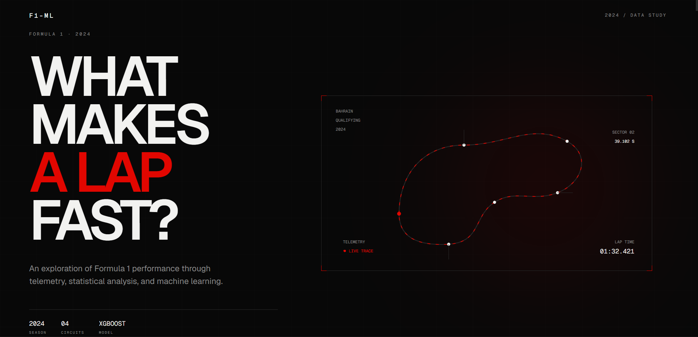

# Formula1-ML

> A data-driven exploration of Formula 1 performance using telemetry, statistical analysis, and machine learning.

<p align="center">
  
</p>

<p align="center">
  <a href="https://formula1-ml.vercel.app">Live Demo</a>
  ·
  <a href="https://github.com/Rick7118/Formula1-ml">Repository</a>
</p>

---

## Overview

Formula1-ML explores the question:

> **What actually makes a Formula 1 lap fast?**

A lap time is the result of many interacting factors rather than a single measurement. This project analyzes Formula 1 performance through lap times, sector performance, speed, tyre degradation, race pace, driver consistency, and track evolution.

The analysis is then turned into a machine learning problem: can telemetry and race-performance features be used to predict lap time?

The project combines a Python-based data and machine learning pipeline with an interactive Next.js application that presents the results as a visual data story.

---

## Live Demo

**[Open Formula1-ML](https://formula1-ml.vercel.app)**

The application presents the analysis as a sequence of sections, moving from raw performance measurements toward the final machine learning model and conclusion.

---

## Preview

### Hero


<p align="center">
  
</p>


# What the Project Explores

The analysis is organized around several questions.

### Lap Performance

How do lap times vary across drivers and laps?

### Sectors

Where around the circuit are performance differences created?

### Speed

Where is speed gained or lost on the circuit?

### Tyres

How does tyre life affect lap-time performance?

### Race Pace

How does performance change as a stint progresses?

### Consistency

How consistently can a driver reproduce performance?

### Track Evolution

How does circuit performance change as track conditions evolve?

### Machine Learning

Can the relationships between these variables be learned by a regression model?

---

# Machine Learning

## Objective

The machine learning component treats lap-time prediction as a regression problem.

The objective is to determine whether telemetry and race-performance features can be used to predict lap time.

The project uses an **XGBoost regression model** for this task.

---

## Machine Learning Pipeline

```text
Raw Formula 1 Data
        │
        ▼
Data Cleaning
        │
        ▼
Feature Engineering
        │
        ▼
Exploratory Data Analysis
        │
        ▼
Feature Selection
        │
        ▼
XGBoost Regression
        │
        ├───────────────┐
        ▼               ▼
    Evaluation     Feature Importance
        │
        ▼
    Predictions
        │
        ▼
   Web Data Builder
        │
        ▼
   JSON Data Files
        │
        ▼
   Next.js Frontend
```

---

## Model

The project uses XGBoost regression to estimate lap time from engineered performance features.

The trained model is stored as:

```text
f1_xgb_model.pkl
```

Model evaluation includes:

| Metric | Purpose |
|---|---|
| MAE | Measures the average absolute prediction error |
| R² | Measures how much of the target variance is explained by the model |

---

## Model Results

Model performance is evaluated using the generated model metrics.

Add the final values here once the model configuration and evaluation results are finalized:

| Metric | Result |
|---|---:|
| MAE | `—` |
| R² | `—` |

> The repository intentionally does not hard-code benchmark values that are not generated by the current training pipeline.

---

## Feature Importance

Feature importance provides a view into which inputs contribute most strongly to the model's predictions.

The web application visualizes these results so that the relationship between the model's inputs and predicted lap time can be explored interactively.

---

# Data Analysis

## Lap Performance

Lap-level data is used to examine differences in performance across the available laps and drivers.

The visualization provides an interactive view of lap times and allows individual observations to be inspected.

---

## Sector Performance

A Formula 1 lap is divided into three sectors:

```text
Sector 1
    ↓
Sector 2
    ↓
Sector 3
```

Analyzing sectors helps identify where time is gained or lost around a circuit.

Instead of treating lap time as one number, the analysis examines the individual components that contribute to it.

---

## Speed

Speed measurements provide another perspective on lap performance.

The analysis examines speed across telemetry points and helps identify where raw speed is expressed on the circuit.

---

## Tyre Degradation

Tyre performance changes as a stint progresses.

The tyre analysis examines the relationship between:

- Tyre compound
- Tyre life
- Lap time
- Normalized performance
- Degradation

This helps visualize the performance cost associated with tyre usage.

---

## Race Pace

Race pace analysis examines how lap performance changes throughout a stint.

The objective is to distinguish between:

```text
Initial Pace
     ↓
Sustained Pace
     ↓
Late-Stint Pace
```

This provides context for understanding how consistently performance can be maintained as tyre life increases.

---

## Driver Consistency

Consistency analysis examines the variation in lap performance.

Rather than focusing exclusively on the fastest lap, the analysis considers how reliably performance can be reproduced.

---

## Track Evolution

Track evolution examines how performance changes as sessions progress.

This provides another layer of context when comparing lap times and telemetry measurements.

---

# Web Application

The frontend is built as an interactive data story rather than a conventional analytics dashboard.

The analysis progresses through the following sections:

```text
01 / THE LAP
      │
      ▼
02 / THE SECTORS
      │
      ▼
03 / SPEED
      │
      ▼
04 / THE TYRES
      │
      ▼
05 / RACE PACE
      │
      ▼
06 / THE MODEL
      │
      ▼
07 / THE VERDICT
```

Each section combines explanatory text with interactive visualizations.

---

## Interactive Visualizations

The application includes:

- Lap performance visualizations
- Sector comparisons
- Speed analysis
- Tyre degradation charts
- Race pace analysis
- Driver consistency analysis
- Track evolution
- Model metrics
- Feature importance
- Prediction analysis

Hover interactions provide additional information for individual data points without overwhelming the main visualization.

---

# Architecture

```text
                     Formula 1 Data
                           │
                           ▼
                    Python Analysis
                           │
                 ┌─────────┴─────────┐
                 ▼                   ▼
          Data Processing       ML Training
                 │                   │
                 │             XGBoost Model
                 │                   │
                 └─────────┬─────────┘
                           ▼
                  Web Data Builder
                           │
                           ▼
                     JSON Datasets
                           │
                           ▼
                    Next.js Frontend
                           │
                           ▼
                        Vercel
```

The current frontend does not require an external API.

The analysis results are generated ahead of time and exposed to the frontend as JSON datasets.

---

# Project Structure

```text
Formula1-ML/
│
├── data/
│   └── web/
│       ├── best-laps.json
│       ├── circuits.json
│       ├── consistency.json
│       ├── feature-importance.json
│       ├── lap-performance.json
│       ├── model-metrics.json
│       ├── overall-consistency.json
│       ├── predictions.json
│       ├── speed.json
│       ├── track-evolution.json
│       └── tyre-degradation.json
│
├── frontend/
│   ├── app/
│   │   ├── globals.css
│   │   ├── layout.tsx
│   │   └── page.tsx
│   │
│   ├── components/
│   │   └── sections/
│   │       ├── LapSection.tsx
│   │       ├── ModelSection.tsx
│   │       ├── RacePaceSection.tsx
│   │       ├── SectorsSection.tsx
│   │       ├── SpeedSection.tsx
│   │       ├── TyreSection.tsx
│   │       └── VerdictSection.tsx
│   │
│   ├── public/
│   │   └── data/
│   │       └── *.json
│   │
│   ├── package.json
│   └── tsconfig.json
│
├── docs/
│   └── hero.png
│
├── Formula1-ML_fixed.ipynb
├── web_data_builder.py
├── f1_full_data.csv
├── f1_xgb_model.pkl
├── .gitignore
├── LICENSE
└── README.md
```

---

# Data Pipeline

The web application consumes pre-generated JSON datasets.

These datasets are produced by:

```text
web_data_builder.py
```

The generated data is stored in:

```text
data/web/
```

and the frontend-facing copies are stored in:

```text
frontend/public/data/
```

The frontend can therefore load the analysis without requiring a live backend API.

---

## Generate Web Data

From the project root:

```bash
python web_data_builder.py
```

After running the script, verify that the generated datasets exist in:

```text
data/web/
```

and, where required by the frontend workflow:

```text
frontend/public/data/
```

---

# Data Files

| File | Purpose |
|---|---|
| `best-laps.json` | Best-lap analysis |
| `circuits.json` | Circuit information |
| `consistency.json` | Driver consistency data |
| `feature-importance.json` | Model feature importance |
| `lap-performance.json` | Lap performance data |
| `model-metrics.json` | Model evaluation metrics |
| `overall-consistency.json` | Overall consistency analysis |
| `predictions.json` | Model predictions |
| `speed.json` | Speed measurements |
| `track-evolution.json` | Track evolution analysis |
| `tyre-degradation.json` | Tyre degradation analysis |

---

# Machine Learning Notebook

The primary analysis notebook is:

```text
Formula1-ML_fixed.ipynb
```

The notebook contains the analysis and machine learning workflow used to process the data, engineer features, train the model, and evaluate the results.

The trained model is saved as:

```text
f1_xgb_model.pkl
```

---

# Getting Started

## Prerequisites

Install the following:

- Python
- Node.js
- npm
- Git

---

## Clone the Repository

```bash
git clone https://github.com/Rick7118/Formula1-ml.git
cd Formula1-ML
```

---

# Run the Frontend

The Next.js application is located in:

```text
frontend/
```

Change into the frontend directory:

```bash
cd frontend
```

Install dependencies:

```bash
npm install
```

Start the development server:

```bash
npm run dev
```

Open:

```text
http://localhost:3000
```

---

# Deployment

The frontend is deployed using Vercel.

Because the Next.js application is located inside the `frontend` directory, the Vercel project uses:

```text
Root Directory: frontend
Framework: Next.js
```

The application currently requires no external API keys.

---

# Technology

## Machine Learning

- Python
- Pandas
- NumPy
- Scikit-learn
- XGBoost
- Jupyter Notebook

## Frontend

- Next.js
- React
- TypeScript
- Tailwind CSS
- Plotly

## Deployment

- Vercel

## Version Control

- Git
- GitHub

---

# Design

Formula1-ML is intentionally designed as a **data story** rather than a conventional dashboard.

The interface moves from observation to explanation:

```text
What happened?
      ↓
Where did it happen?
      ↓
Why did it happen?
      ↓
Can a model learn it?
      ↓
What does the data tell us?
```

The visual language uses:

- Dark surfaces
- High-contrast typography
- Minimal red accents
- Technical monospace labels
- Grid-based layouts
- Interactive telemetry visualizations
- Sequential storytelling

The goal is to make the analysis feel closer to a Formula 1 technical report than a generic analytics dashboard.

---

# Development Workflow

The general workflow for extending the project is:

```text
Analyze Data
     │
     ▼
Update Notebook
     │
     ▼
Train / Evaluate Model
     │
     ▼
Generate Web Data
     │
     ▼
Update Frontend
     │
     ▼
Test Locally
     │
     ▼
Commit Changes
     │
     ▼
Push to GitHub
     │
     ▼
Deploy
```

---

# Current Status

The following components are implemented:

- [x] Formula 1 data analysis
- [x] Data preprocessing
- [x] Feature engineering
- [x] Exploratory analysis
- [x] XGBoost regression
- [x] Model evaluation
- [x] Feature importance
- [x] Lap performance analysis
- [x] Sector analysis
- [x] Speed analysis
- [x] Tyre degradation analysis
- [x] Race pace analysis
- [x] Driver consistency analysis
- [x] Track evolution analysis
- [x] Interactive Next.js application
- [x] Interactive visualization hover states
- [x] Prediction visualization
- [x] GitHub repository
- [x] Vercel deployment
- [ ] Additional model experiments

---

# Repository

Source code and analysis:

**[github.com/Rick7118/Formula1-ml](https://github.com/Rick7118/Formula1-ml)**

---

# License

This project is licensed under the MIT License.

See the [`LICENSE`](LICENSE) file for details.

---

# Author

**Subhayu Sengupta**

Computer Science and Business Systems

---

<p align="center">
  <sub>Formula 1 · Machine Learning · Data Analysis · 2024</sub>
</p>